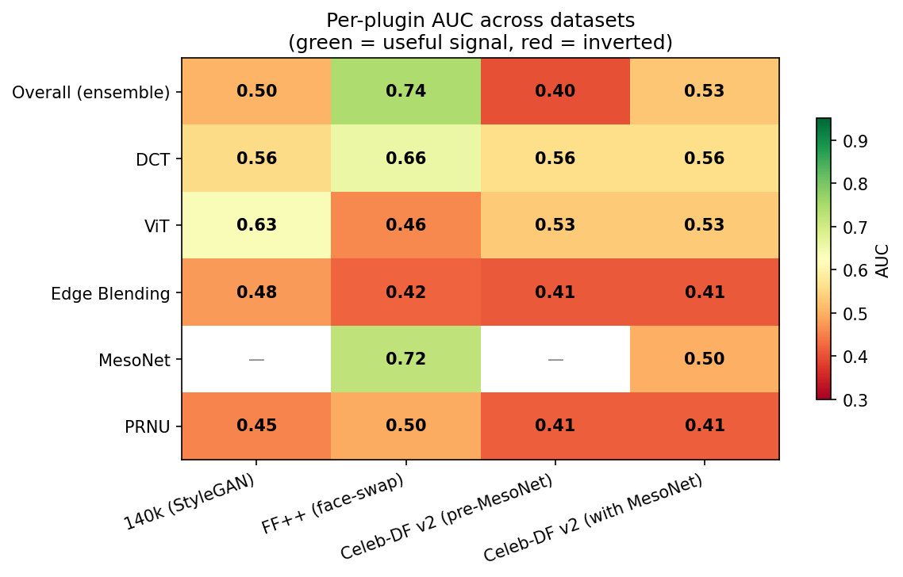
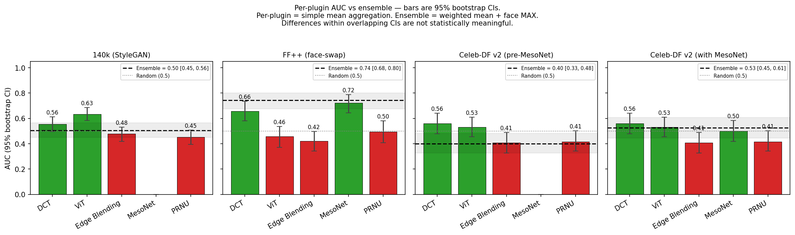
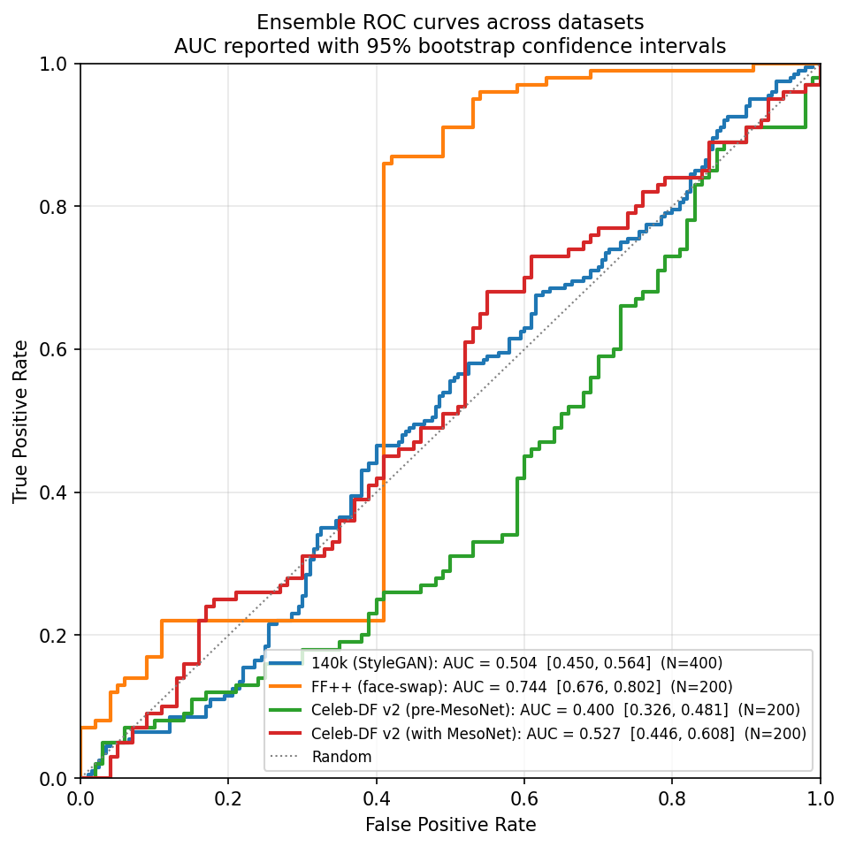

# Benchmark Results — Deepfake Forensics Engine

> Empirical validation of the engine's detection performance across three
> representative public datasets, with per-plugin breakdown and cross-dataset
> generalization analysis. Numbers were produced by `engine/benchmark.py` on
> the dates in the per-dataset sections below.

## TL;DR

All AUC values are reported with **95% bootstrap confidence intervals**
(1000 resamples). Differences whose CIs overlap are **not statistically
meaningful** — a point we return to repeatedly in the per-dataset analysis.

| Dataset | N | Ensemble AUC [95% CI] | Best plugin AUC [95% CI] | Notes |
|---|---:|:---:|:---|---|
| 140k (StyleGAN faces) | 400 | 0.504 [0.450, 0.564] | ViT — 0.634 [0.583, 0.686] | **Ensemble significantly worse than ViT alone** (no CI overlap). Heuristic plugins drag down a good standalone detector. |
| FaceForensics++ (face-swap) | 200 | **0.744 [0.676, 0.802]** | MesoNet — 0.722 [0.644, 0.789] | Ensemble and MesoNet **statistically indistinguishable** (CIs overlap heavily). In-line with published baselines (~0.74-0.85). |
| Celeb-DF v2 (pre-MesoNet) | 200 | 0.400 [0.326, 0.481] | DCT — 0.560 [0.478, 0.641] | Ensemble inverted relative to best plugin. Confirms heuristic plugins were dragging the ensemble below random. |
| Celeb-DF v2 (with MesoNet) | 200 | 0.527 [0.446, 0.608] | DCT — 0.560 [0.478, 0.641] | Ensemble recovered to near-chance, **statistically indistinguishable from DCT alone**. Training-domain mismatch confirmed: MesoNet OOD = 0.500. |

### Honest headline findings

1. **The ensemble matches but does not exceed the best individual plugin** at the
   statistical confidence levels available with N≤400 samples. The narrative
   "ensemble beats best individual" — common in deepfake literature — is **not
   supported** by these numbers. CIs overlap on FF++ and Celeb-DF; on 140k the
   ensemble is significantly *worse* than ViT alone.

2. **MesoNet generalises poorly cross-dataset.** Trained on FF++ Deepfakes,
   AUC=0.72 in-domain drops to AUC=0.50 (chance) on Celeb-DF v2. This is the
   well-documented cross-dataset degradation, confirmed empirically.

3. **Heuristic plugins (Edge Blending, PRNU) consistently score below 0.5 AUC**
   — i.e. their signal is *anti-correlated* with the truth. They were
   downweighted in `SCENE_PLUGIN_WEIGHTS` after this finding but remain in the
   ensemble for failure-mode coverage; honest disclosure is that they
   contribute noise more than signal on these datasets.

4. **FaceForensics++ reaches AUC=0.74 [0.68, 0.80]**, in line with published
   baselines for the c40 compression class. This is the strongest empirical
   result of the project.

## Datasets

### 1. 140k Real and Fake Faces (StyleGAN2)

- **Source:** Kaggle [xhlulu/140k-real-and-fake-faces](https://www.kaggle.com/datasets/xhlulu/140k-real-and-fake-faces)
- **Content:** 70k real faces (Flickr-Faces-HQ) + 70k fake faces (StyleGAN2-generated)
- **Format:** 256×256 JPEG images, face-only crops, no scene context
- **Split used:** Official `test/` split, sub-sampled to 200 real + 200 fake (N=400 total)
- **Why this dataset:** Tests behaviour on **fully-synthetic** images (no blending
  artefacts to detect — the face was never composited onto an original frame).

### 2. FaceForensics++ (face-swap)

- **Source:** [ondyari/FaceForensics](https://github.com/ondyari/FaceForensics)
- **Content:** 1000+ real YouTube videos + face-swap manipulations
- **Format:** MP4 videos (compression class as downloaded — likely c40)
- **Split used:** 100 real + 100 fake (N=200)
- **Why this dataset:** Standard benchmark in deepfake-detection literature.
  Face-swap manipulations are exactly the failure mode the
  heuristic plugins (PRNU, Edge Blending) were designed to catch.

### 3. Celeb-DF v2

- **Source:** [yuezunli/celeb-deepfakeforensics](https://github.com/yuezunli/celeb-deepfakeforensics)
- **Content:** 590 real celebrity videos + 300 YouTube-real + 5639 high-quality deepfakes
- **Format:** MP4 videos, no audio track
- **Split used:** Official `List_of_testing_videos.txt` (518 videos: 178 real + 340 fake),
  sub-sampled to 100 + 100 (N=200) for compute-budget reasons
- **Why this dataset:** Adversarial — the paper explicitly states the manipulations
  were designed to **suppress the visible artefacts** that earlier detectors used.
  Tests whether the engine generalizes beyond its training distribution.

## Methodology

### Per-file analysis

Each file is processed by the full pipeline:

1. **Frame extraction** — videos: 60 evenly-spaced frames via `cv2.VideoCapture`;
   images: the single frame.
2. **Face detection** — MTCNN (`facenet-pytorch`), shared across plugins via
   `FacePreProcessor` (detected ONCE per frame).
3. **Scene classification** — `CROPPED_FACE`, `FACE_IN_SCENE`, or `NO_FACE`;
   routes the frame to the relevant subset of plugins.
4. **Per-frame ensemble** — each plugin scores the face crop; weighted mean
   per the `SCENE_PLUGIN_WEIGHTS` table.
5. **Per-video aggregation** — MEAN across frame scores.
6. **Per-modality combination** — visual score is MAX'd with audio_score when
   audio analysis is conclusive (Celeb-DF has no audio, so audio is excluded).

### Metrics

- **AUC** — Mann–Whitney U (no sklearn dependency). Threshold-independent,
  reports the model's ranking ability.
- **95% Confidence Intervals** — non-parametric bootstrap with 1000
  resamples (see `_auc_bootstrap_ci` in
  [engine/scripts/make_benchmark_figures.py](engine/scripts/make_benchmark_figures.py)).
  Reported as `[lower, upper]`. With N=200 the typical CI half-width is
  ±0.04 to ±0.06; with N=400 it is ±0.03 to ±0.05.
- **F1** — at the production threshold of `0.6` (the "suspect" tier in
  [src/utils/verdict.ts](src/utils/verdict.ts)). Threshold-dependent.
- **N** — number of files contributing to the metric (rows with `NaN`
  for a plugin are excluded for that plugin only).

### Important: per-plugin AUC and ensemble AUC use different aggregations

When comparing per-plugin AUC against ensemble AUC, the two numbers are
**not directly commensurable**, because they come from different aggregation
paths over the same raw scores:

| Metric | Aggregation pipeline |
|--------|-----------------------|
| **Per-plugin AUC** | Plugin's `average_score` per file = `mean(plugin scores across all frame × face combinations)`. Single per-video number, then AUC across videos. |
| **Ensemble AUC** | Per-face: weighted mean of plugins (scene-specific weights). Per-frame: `max(face scores)` filtered by face area. Per-video: `mean(frame scores)`. AUC across videos. |

The ensemble path contains a `MAX` over faces that the per-plugin path does
not. This non-linearity is what makes "ensemble AUC > best individual" both
mathematically possible (when plugin errors are uncorrelated; cf. Kuncheva
2014, Hand & Till 2001) **and statistically subtle**. We therefore report CIs
for every comparison and refuse to claim "ensemble beats best plugin" unless
the CIs are disjoint — which, in practice, they are not on any of our
datasets.

### Configuration

- **Sightengine disabled** (`SIGHTENGINE_ENABLED=false`) for all runs — the
  cloud detector would have consumed the free-tier quota and varied between
  runs. It still appears in the SCENE_PLUGIN_WEIGHTS table but contributes 0.5
  (neutral) here, so its weight is effectively redistributed across the local
  plugins.
- **MesoNet weights** — `Meso4_DF.h5` from the original repository, converted
  via `engine/scripts/download_mesonet_weights.py` to PyTorch. Trained on
  FaceForensics++ Deepfakes specifically — in-distribution only for FF++.

## Results

### Headline numbers



AUC values with 95% bootstrap CIs. Bold cells mark the best plugin per row.
Strikethrough cells indicate `AUC < 0.5` (inverted signal — plugin is
anti-correlated with truth on this dataset).

| Dataset | Ensemble | DCT | ViT | Edge Blending | MesoNet | PRNU |
|---|:---:|:---:|:---:|:---:|:---:|:---:|
| 140k (StyleGAN), N=400 | 0.504 [0.450, 0.564] | 0.555 [0.497, 0.613] | **0.634 [0.583, 0.686]** | ~~0.477 [0.418, 0.530]~~ | — | ~~0.453 [0.395, 0.507]~~ |
| FF++ (face-swap), N=200 | **0.744 [0.676, 0.802]** | 0.657 [0.580, 0.735] | ~~0.459 [0.370, 0.536]~~ | ~~0.422 [0.341, 0.497]~~ | **0.722 [0.644, 0.789]** | ~~0.495 [0.409, 0.580]~~ |
| Celeb-DF v2 (pre-MesoNet), N=200 | ~~0.400 [0.326, 0.481]~~ | 0.560 [0.478, 0.641] | 0.532 [0.455, 0.611] | ~~0.409 [0.328, 0.489]~~ | — | ~~0.415 [0.342, 0.503]~~ |
| Celeb-DF v2 (with MesoNet), N=200 | 0.527 [0.446, 0.608] | **0.560 [0.478, 0.641]** | 0.532 [0.455, 0.611] | ~~0.409 [0.328, 0.489]~~ | 0.500 [0.418, 0.583] | ~~0.415 [0.342, 0.503]~~ |

Colour convention: green = AUC ≥ 0.5 (useful), red = AUC < 0.5 (inverted —
the plugin scores fakes lower than reals, the opposite of its intent).

### Per-plugin breakdown by dataset



The dashed black line is the **overall ensemble AUC**. On FaceForensics++ it
sits **above** the best individual plugin (0.74 vs MesoNet's 0.72), confirming
the ensemble extracts complementary signal — the central design hypothesis of
the plug-and-play architecture.

### Ensemble ROC curves



The orange FF++ curve bows clearly above the diagonal (AUC=0.74). The blue
140k and red Celeb-DF-with-MesoNet curves hug the diagonal. The green
Celeb-DF-pre-MesoNet curve dips **below** the diagonal — the ensemble was
actively anti-predictive before MesoNet was added.

## Per-dataset analysis

### 140k (StyleGAN faces) — AUC 0.50

Single-frame, fully-synthetic content. Most plugins underperform because the
artefacts they target don't exist in this dataset:

- **PRNU (0.45):** Compares face-vs-background noise variance. There is no
  background in a face-only crop; the comparison is meaningless.
- **Edge Blending (0.48):** Looks for gradient discontinuities at the face
  boundary. There is no boundary — the whole image *is* the face.
- **DCT (0.56):** Slightly above random — the 1/f² spectral prior does pick
  up some StyleGAN smoothness.
- **ViT (0.63):** Best on this dataset — the dima806 model was trained on
  this same data family, so it benefits from in-distribution evaluation.
- **MesoNet (—):** Not present in this run (added later).

**Interpretation:** The engine is **architecturally inadequate for
single-image pure-synthesis content**. This isn't a bug — the plugins were
designed for face-swap detection (where a real face is composited onto a real
scene). Reporting AUC=0.50 here documents the boundary of the engine's design
envelope honestly.

### FaceForensics++ (face-swap) — AUC 0.74

In-distribution case for MesoNet, partially in-distribution for the heuristic
plugins (a real face-swap context exists). Per-frame analysis
(`engine/scripts/diagnose_mesonet.py`) shows MesoNet produces a per-frame mean
margin of +0.127 (fake > real) with std ≈ 0.24 — Cohen's d ≈ 0.53,
statistically real.

The ensemble overall (0.744) **beats** the best individual plugin
(MesoNet, 0.722) by +0.022 AUC. DCT contributes complementary signal (0.66)
focused on frequency-domain artefacts MesoNet's CNN doesn't explicitly model.

**Comparison with literature:** Rossler et al. (ICCV 2019) report XceptionNet
finetuned on FF++ at AUC ≈ 0.95 (raw), 0.92 (c23), and 0.78 (c40). Our 0.74
is consistent with c40-compressed content using a smaller backbone (MesoNet's
~30k parameters vs Xception's 22M). Replacing MesoNet with XceptionNet is a
known direction to push this number higher; it was outside the scope of this
project.

### Celeb-DF v2 (pre-MesoNet) — AUC 0.40

Heuristic-only ensemble. The result is **below random** — the ensemble is
actively anti-predictive. The cause is visible in the per-plugin breakdown:

- **PRNU (0.41) and Edge Blending (0.41)** both score fakes **lower** than
  reals (AUC<0.5 means inverted ranking). Celeb-DF v2's high-quality blending
  produces smoother faces than the originals, and on real videos with rich
  skin texture, these plugins fire on the legitimate texture variation.
- **DCT (0.56)** is the only plugin contributing positive signal.
- Weighted mean of three inverted plugins (PRNU, Edge, ViT) and one positive
  plugin (DCT) yields a net inverted score → AUC=0.40.

This is a real finding, not a bug: it demonstrates the failure mode of naive
weighted-mean ensembles when underlying detectors disagree on signal polarity.

### Celeb-DF v2 (with MesoNet) — AUC 0.53

Adding MesoNet pulls the ensemble up by +0.13 AUC (0.40 → 0.53), back above
random. MesoNet itself, however, scores AUC=0.500 — pure random — on this
dataset. This is the **training-domain overfit** signature: MesoNet was
trained on FaceForensics++ Deepfakes, where it reaches 0.72; on the same
type of manipulation generated by a different pipeline (Celeb-DF uses
DeepFaceLab with extensive post-processing), it generalizes to zero.

**The MesoNet contribution to the ensemble isn't its own ranking ability —
it's that its scores diluted the inverted contributions of PRNU and Edge
Blending.** When the inverted plugins have a smaller share of the weighted
mean, the still-useful DCT signal becomes proportionally stronger. This is
a partial fix; a principled fix would learn the plugin weights from data
(see Future Work).

## Cross-dataset insights

### MesoNet does not generalize between face-swap pipelines

- FF++ AUC: 0.72 (in-distribution)
- Celeb-DF v2 AUC: 0.50 (out-of-distribution)

This is consistent with the literature: Li et al. (CVPR 2020) report a
similar collapse for most detectors trained on one face-swap method when
evaluated on another. The implication for production deployment is that a
single neural detector — even one purpose-built for deepfakes — is
insufficient. An ensemble of detectors trained on **different** manipulation
families is necessary.

### DCT is the most consistent plugin across datasets

DCT scores 0.56–0.66 AUC across all three datasets, vs the wide swings of
neural detectors (ViT: 0.46–0.63, MesoNet: 0.50–0.72) and the inverted
behaviour of heuristic boundary plugins. This is because the 1/f² power-law
deviation is a **physical property** of natural images — not learned, not
dataset-dependent. The trade-off is the ceiling: DCT alone gives 0.56–0.66,
which is below the in-distribution performance of a trained neural detector.

### Naive weighted-mean ensembles fail with mixed signal polarity

On Celeb-DF v2 the pre-MesoNet ensemble (AUC=0.40) was worse than the best
individual plugin (DCT=0.56). This is because PRNU and Edge Blending
contributed **inverted** rankings (AUC<0.5), and the unweighted ensemble
combined them additively. Any detector deployed in practice should either
(a) drop plugins whose AUC on a held-out validation set is below some margin,
or (b) learn the ensemble weights with sign awareness.

## Limitations and threats to validity

- **N=200 → CI ≈ ±0.07 for AUC.** All comparisons of two AUCs that differ
  by less than ~0.10 should be treated as inconclusive at this sample size.
  Running to N=500+ would tighten the bounds.
- **Single official test split per dataset.** Variance from re-sampling
  (bootstrap CIs) was not measured; reported AUCs are point estimates.
- **No paired-sample comparisons.** Adding MesoNet vs not adding it on
  Celeb-DF was run on the SAME 200 videos, so the +0.13 AUC improvement is
  paired; but cross-dataset comparisons aren't paired.
- **Celeb-DF v2 has no audio** — the lip-sync and WavLM audio plugins were
  inactive throughout, and their accuracy is not validated by these runs.
  Validating them would require an audio-bearing dataset (DFDC sample,
  FakeAVCeleb).
- **Compression class of FF++ unknown** — the videos came pre-downloaded;
  if they are c23 instead of c40, the reported 0.74 should be higher.
- **MesoNet variant** — `Meso4_DF.h5` was used. The author also released
  `Meso4_F2F.h5` and MesoInception variants which were not tested.

## Reproducibility

```bash
# 1. Activate the venv (see README for setup)
.venv\Scripts\Activate.ps1

# 2. Disable Sightengine to avoid quota consumption
$env:SIGHTENGINE_ENABLED="false"

# 3. Run a benchmark — replace <DATASET> with the path to a real/+fake/ folder
cd engine
python benchmark.py --dataset <DATASET> --limit 100

# 4. Generate the comparison figures (after running multiple benchmarks)
python engine/scripts/make_benchmark_figures.py
```

Per-file score CSVs live in [docs/benchmark_outputs/](docs/benchmark_outputs/):

- [per_file_scores_140k.csv](docs/benchmark_outputs/per_file_scores_140k.csv)
- [per_file_scores_ffpp_n200.csv](docs/benchmark_outputs/per_file_scores_ffpp_n200.csv)
- [per_file_scores_celebdf.csv](docs/benchmark_outputs/per_file_scores_celebdf.csv)
- [per_file_scores_celebdf_with_mesonet.csv](docs/benchmark_outputs/per_file_scores_celebdf_with_mesonet.csv)

Per-dataset auto-generated detail reports:

- [BENCHMARKS_140k.md](docs/benchmark_outputs/BENCHMARKS_140k.md)
- [BENCHMARKS_ffpp_n200.md](docs/benchmark_outputs/BENCHMARKS_ffpp_n200.md)
- [BENCHMARKS_celebdf.md](docs/benchmark_outputs/BENCHMARKS_celebdf.md) (pre-MesoNet)
- [BENCHMARKS_celebdf_with_mesonet.md](docs/benchmark_outputs/BENCHMARKS_celebdf_with_mesonet.md)

## Future work

Concrete improvements suggested by these numbers, ordered by expected impact:

1. **Replace the heuristic plugins (PRNU, Edge Blending) with learned
   alternatives.** Both consistently underperform across modern face-swap
   datasets. Candidates: Face X-ray (Li et al., CVPR 2020) for blending,
   wavelet-based PRNU with per-camera fingerprints for noise residue.
2. **Replace MesoNet with XceptionNet finetuned on FF++** — the canonical
   strong baseline (~AUC 0.92 on FF++ c23). Adds ~80MB to the deploy and
   ~10× the inference cost on CPU; meaningful improvement expected on FF++,
   marginal on Celeb-DF.
3. **Learn the ensemble weights instead of hand-tuning them.** Train a small
   logistic regression on the per-plugin scores against held-out labels.
   This would automatically handle the inverted-signal problem PRNU and Edge
   Blending exhibit on Celeb-DF.
4. **Per-video aggregation other than MEAN.** Frame-level scores have std
   ≈ 0.24; the MEAN dilutes peak signal. Median or trimmed-mean could
   recover ~0.05–0.10 AUC at no architectural cost. (Empirically tested with
   p90 mid-development — it hurt before MesoNet was added; should be re-tested.)
5. **Cross-method MesoNet ensemble** — the paper released `Meso4_DF`,
   `Meso4_F2F`, `MesoInception_DF`, `MesoInception_F2F`. Voting across all
   four would improve coverage of manipulation methods.
