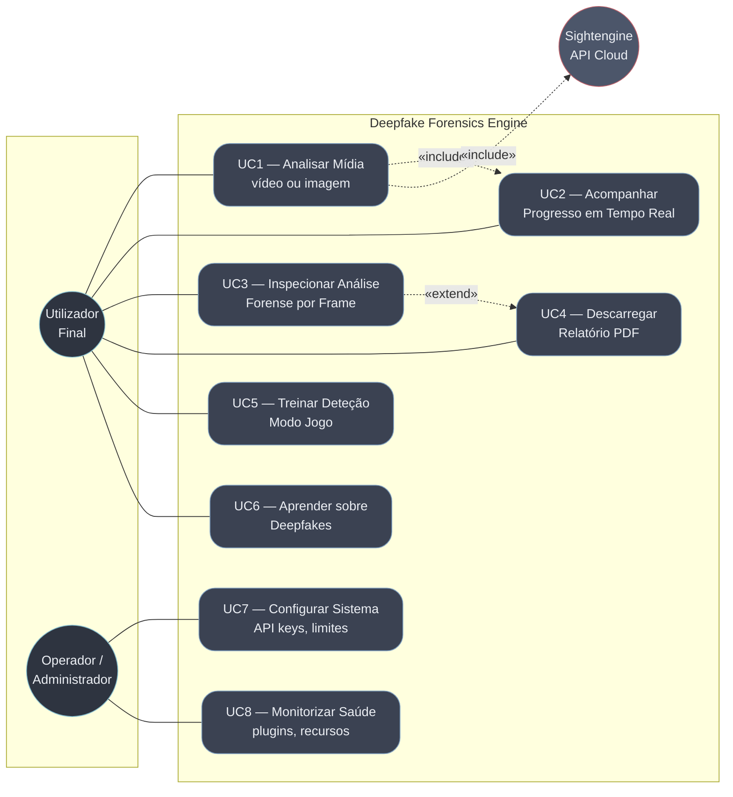

# Diagrama de Casos de Uso

Atores e funcionalidades expostas pelo sistema (Cap. 3.2 do relatório).

## Atores

| Ator | Descrição |
|------|-----------|
| **Utilizador Final** | Pessoa que carrega media para análise através do dashboard web. Pode também usar os modos pedagógicos (jogo / aprendizagem). |
| **Operador / Administrador** | Responsável pelo deployment e configuração do sistema (variáveis de ambiente, API keys, rate limits). Monitoriza saúde via `/health`. |
| **Sightengine (Sistema Externo)** | API cloud comercial invocada pelo plugin homónimo quando configurado, devolvendo score de deepfake/AI-generated. |

## Diagrama

## Descrição dos casos de uso principais

### UC1 — Analisar Mídia
**Ator primário**: Utilizador Final
**Pré-condições**: Sistema operacional; quando `ENGINE_API_KEYS` está definido, o utilizador possui chave válida.
**Fluxo principal**:
1. Utilizador acede ao dashboard e seleciona ficheiro (vídeo ou imagem).
2. Sistema valida autenticação, rate limit (`ENGINE_RATE_LIMIT_PER_MIN`) e tamanho (`ENGINE_MAX_UPLOAD_MB`).
3. Sistema armazena ficheiro em diretório temporário, atribui `task_id` e devolve-o ao cliente.
4. Sistema inicia análise em background; cliente entra em UC2 para acompanhar.
5. Quando análise termina, sistema notifica via SSE e disponibiliza resultado em `/api/result/{task_id}`.

**Pós-condições**: Resultado persistido em memória do servidor; frames extraídos disponíveis para inspeção (UC3).
**Fluxos alternativos**: Falha de validação → HTTP 4xx; falha durante análise → estado `FAILED` com mensagem de erro.

### UC2 — Acompanhar Progresso em Tempo Real
**Inclusão obrigatória de UC1.** Cliente subscreve `/api/progress/stream?task_id=…` (Server-Sent Events) e recebe atualizações de percentagem e fase corrente até completar.

### UC3 — Inspecionar Análise Forense por Frame
Utilizador navega timeline de frames, vê bounding boxes coloridas (verde/amarelo/vermelho) por cara detetada, scores por plugin e cenário classificado (`CROPPED_FACE` / `FACE_IN_SCENE` / `NO_FACE`).

### UC4 — Descarregar Relatório PDF
**Extensão de UC3.** Cliente solicita PDF que inclui veredicto global, scores por analyzer, e gráficos por frame.

### UC5 — Treinar Deteção (Modo Jogo)
Utilizador joga deepfake-vs-real com imagens curadas. Métricas pessoais (acertos, série) persistidas em `localStorage`.

### UC6 — Aprender sobre Deepfakes
Página educacional explicando tipos de manipulação, artefactos típicos, técnicas de deteção.

### UC7 — Configurar Sistema
Operador define `ENGINE_API_KEYS`, `ENGINE_RATE_LIMIT_PER_MIN`, `ENGINE_MAX_UPLOAD_MB`, `SIGHTENGINE_*` via variáveis de ambiente (`.env` ou orquestrador).

### UC8 — Monitorizar Saúde
Endpoint `GET /health` devolve estado por plugin (`configured`, `supports_batch`), modelos carregados, e versão. Usado por `docker-compose` healthcheck.

## Relacionamentos UML

| Relação | Origem → Destino | Significado |
|---------|------------------|-------------|
| «include» | UC1 → UC2 | Toda a análise propaga progresso via SSE. |
| «include» | UC1 → Sightengine | Quando `SIGHTENGINE_ENABLED=true`, plugin cloud é invocado durante análise. |
| «extend» | UC3 → UC4 | Geração de PDF é opcional, despoletada da inspeção. |
