# Diagrama de Atividade — Fluxo principal de análise

Mapeia o fluxo de trabalho do caso de uso **UC1 (Analisar Mídia)**, desde o upload do utilizador até à disponibilização do resultado (Cap. 3.3 do relatório).

```mermaid
flowchart TD
    Start([Utilizador acede ao Dashboard])
    Upload[Selecciona ficheiro<br/>vídeo ou imagem]
    POST[POST /api/analyze<br/>multipart/form-data]

    AuthCheck{ENGINE_API_KEYS<br/>definido?}
    AuthOK{X-API-Key<br/>válido?}
    Reject401[/HTTP 401<br/>Unauthorized/]

    RateCheck{Rate limit<br/>excedido?}
    Reject429[/HTTP 429<br/>Too Many Requests/]

    SizeCheck{Tamanho<br/>≤ MAX_UPLOAD_MB?}
    Reject413[/HTTP 413<br/>Payload Too Large/]

    SaveTmp[Grava em /tmp<br/>cria task_id UUID]
    Respond[Devolve task_id<br/>HTTP 202]

    SubscribeSSE[Cliente subscreve<br/>SSE /api/progress/stream]

    BgStart[Background Task<br/>inicia]
    Extract[Extrai frames<br/>cv2.VideoCapture]

    LoopFrames{Próximo<br/>frame?}

    FaceDetect[FacePreProcessor<br/>MTCNN detect]
    SceneClass[SceneClassifier<br/>classifica cenário]
    BatchPath{Plugin<br/>SUPPORTS_BATCH<br/>e ≥2 caras?}
    BatchInfer[analyze_frames_batch<br/>ViT, MesoNet]
    PerFace[Por cada cara:<br/>analyze_frame plugins ativos]
    Aggregate[Agrega: MAX<br/>por frame]
    EmitProgress[Emite progresso<br/>via SSE]

    AfterFrames[Termina loop<br/>de frames]
    VideoAnalyzers[Corre analyzers<br/>de vídeo:<br/>Metadata, Temporal,<br/>rPPG, LipSync, Audio]
    FinalScore[Calcula overall_score<br/>média dos frames]
    Persist[Persiste resultado<br/>em memória]
    NotifyDone[SSE: 'completed']

    Inspect[Utilizador inspeciona<br/>frames + bboxes]
    OptPDF{Gerar PDF?}
    PDF[Descarrega<br/>relatório PDF]
    End([Fim])

    Start --> Upload --> POST
    POST --> AuthCheck
    AuthCheck -- não --> RateCheck
    AuthCheck -- sim --> AuthOK
    AuthOK -- não --> Reject401
    AuthOK -- sim --> RateCheck
    RateCheck -- sim --> Reject429
    RateCheck -- não --> SizeCheck
    SizeCheck -- não --> Reject413
    SizeCheck -- sim --> SaveTmp
    SaveTmp --> Respond
    Respond --> SubscribeSSE
    Respond --> BgStart

    BgStart --> Extract --> LoopFrames
    LoopFrames -- sim --> FaceDetect --> SceneClass --> BatchPath
    BatchPath -- sim --> BatchInfer --> PerFace
    BatchPath -- não --> PerFace
    PerFace --> Aggregate --> EmitProgress --> LoopFrames

    LoopFrames -- não --> AfterFrames --> VideoAnalyzers --> FinalScore --> Persist --> NotifyDone

    SubscribeSSE --> NotifyDone
    NotifyDone --> Inspect --> OptPDF
    OptPDF -- sim --> PDF --> End
    OptPDF -- não --> End

    classDef startend fill:#a3be8c,stroke:#2e3440,color:#2e3440
    classDef decision fill:#ebcb8b,stroke:#2e3440,color:#2e3440
    classDef error fill:#bf616a,stroke:#2e3440,color:#eceff4
    classDef action fill:#5e81ac,stroke:#2e3440,color:#eceff4
    classDef async fill:#b48ead,stroke:#2e3440,color:#eceff4

    class Start,End startend
    class AuthCheck,AuthOK,RateCheck,SizeCheck,LoopFrames,BatchPath,OptPDF decision
    class Reject401,Reject429,Reject413 error
    class Upload,POST,SaveTmp,Respond,Extract,FaceDetect,SceneClass,PerFace,Aggregate,VideoAnalyzers,FinalScore,Persist,Inspect,PDF action
    class BgStart,BatchInfer,EmitProgress,NotifyDone,SubscribeSSE async
```

## Notas de leitura

### Caminhos paralelos
Após `Respond` (HTTP 202), o fluxo bifurca em duas atividades concorrentes:
- **Cliente**: subscreve SSE e aguarda eventos.
- **Servidor**: executa análise em background thread (FastAPI `BackgroundTasks`).

A reconvergência acontece em `NotifyDone`, quando o servidor emite o evento final via SSE.

### Pontos de decisão críticos
| Decisão | Lógica | Localização |
|---------|--------|-------------|
| `SUPPORTS_BATCH` | Atributo de classe nos plugins ([linha 145 mesonet_detector.py](../../engine/plugins/mesonet_detector.py#L145), [linha 52 vit_detector.py](../../engine/plugins/vit_detector.py#L52)) | `plugin_manager._run_analysis_locked` |
| Cenário (CROPPED_FACE / FACE_IN_SCENE / NO_FACE) | Rácio área da face / área do frame ≥ 0.50 | `SceneClassifier.classify` |
| Plugin ativo | Presença em `SCENE_PLUGIN_WEIGHTS[scene]` | `SceneClassifier.get_active_plugins_and_weights` |

### Optimizações representadas no diagrama
1. **Face detection partilhada**: MTCNN corre uma vez por frame, resultado reutilizado por todos os plugins (evita N invocações).
2. **Batched inference**: quando ≥2 caras no mesmo frame e o plugin suporta batch, processa todas numa só forward pass (~5× speedup em CPU, mais em GPU).
3. **Skip de plugins irrelevantes**: cena `NO_FACE` salta MesoNet, ViT, Edge Blending, PRNU (que requerem ROI facial).
