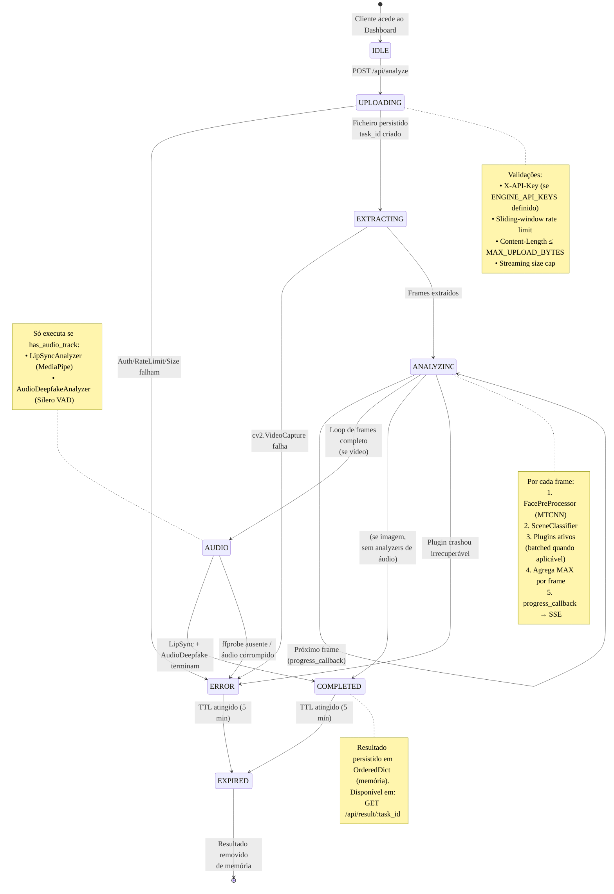

# Diagrama de Estados — Ciclo de vida de uma análise

Descreve as transições possíveis de uma análise (`task_id`) desde a sua criação até à expiração (Cap. 3.3 do relatório).

Os estados correspondem ao campo `stage` propagado via SSE em `/api/progress/stream` (ver [main.py](../../engine/main.py)).

## Tabela de transições

| Estado origem | Evento | Estado destino | Ação |
|----------------|--------|----------------|------|
| `IDLE` | `POST /api/analyze` | `UPLOADING` | Validar request, ler stream |
| `UPLOADING` | Auth falha | `ERROR` | HTTP 401 |
| `UPLOADING` | Rate limit excedido | `ERROR` | HTTP 429 |
| `UPLOADING` | Tamanho excede limite | `ERROR` | HTTP 413 |
| `UPLOADING` | Stream lido OK | `EXTRACTING` | Cria task_id, agenda background task |
| `EXTRACTING` | `cv2.VideoCapture` falha | `ERROR` | Devolve mensagem ao cliente via SSE |
| `EXTRACTING` | N frames extraídos | `ANALYZING` | Inicia loop de plugins |
| `ANALYZING` | Frame processado | `ANALYZING` | Emite progresso (X/N) |
| `ANALYZING` | Loop completo (vídeo) | `AUDIO` | Verifica se faixa de áudio existe |
| `ANALYZING` | Loop completo (imagem) | `COMPLETED` | Skip analyzers de áudio |
| `ANALYZING` | Exceção em plugin | `ANALYZING` | Score neutral 0.5 (continua); plugin marcado em `plugin_errors` |
| `AUDIO` | Analyzers OK | `COMPLETED` | Persiste payload final |
| `AUDIO` | ffprobe ausente | `COMPLETED` | Análise de áudio omitida; vídeo continua válido |
| `COMPLETED` | Cliente fez `GET /api/result` | `COMPLETED` | Devolve payload (mas marca para limpeza) |
| `COMPLETED` / `ERROR` | TTL 5 min | `EXPIRED` | Remove de memória, libera /tmp |
| `EXPIRED` | — | `[*]` | Fim do ciclo |

## Pontos de robustez documentados

### Falha graciosa de plugin
Quando um plugin lança exceção em `analyze_frame`, a análise **não aborta**. O `plugin_manager._run_analysis_locked` ([linha 451-464 plugin_manager.py](../../engine/core/plugin_manager.py#L451)):
1. Captura exceção
2. Incrementa `plugin_errors[plugin.plugin_name]`
3. Loga apenas a primeira falha por plugin (evita flood)
4. Usa score `0.5` neutro como fallback
5. Continua para o próximo plugin/frame

### Idempotência de `reset()`
Antes de cada análise, todos os plugins recebem `reset()` ([plugin_manager.py linha 352-356](../../engine/core/plugin_manager.py#L352)). Plugins stateful (ex: Sightengine, que mantém `_frame_counter` e `_cached_score`) limpam estado para evitar leakage entre análises sucessivas.

### TTL e limpeza de memória
Resultados completos vivem 5 minutos em `OrderedDict` LRU. Ficheiros temporários em `/tmp/<uuid>` são removidos imediatamente após análise terminar (sucesso ou erro).
