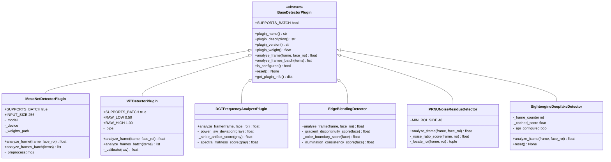
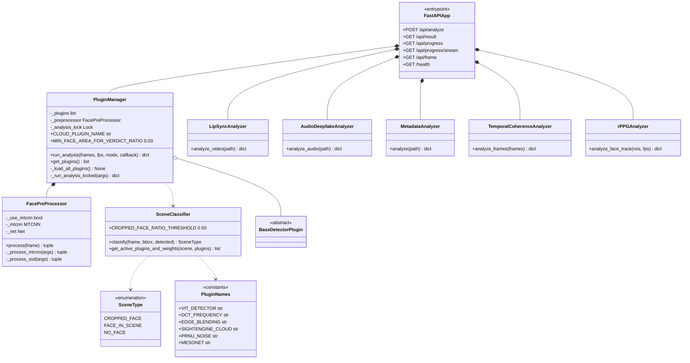

# Diagrama de Classes — Arquitetura do Engine

Representa a estrutura orientada a objetos do backend (Cap. 3.4 do relatório).
Por legibilidade e fiabilidade de render, está dividido em dois diagramas:

1. **Hierarquia de plugins** — contrato `BaseDetectorPlugin` e as 6 implementações concretas.
2. **Orquestração + analyzers vídeo-level** — `PluginManager`, `FacePreProcessor`, `SceneClassifier`, e os analyzers que correm sobre o vídeo completo.

---

## 1. Hierarquia de plugins

---

## 2. Orquestração e analyzers vídeo-level

---

## Padrões de design aplicados

| Padrão | Onde | Porquê |
|--------|------|--------|
| **Plugin / Strategy** | `BaseDetectorPlugin` + 6 implementações | Permite adicionar detetores sem alterar o `PluginManager`. Drop-in: basta colocar `.py` em `engine/plugins/`. |
| **Auto-discovery** | `PluginManager._load_all_plugins` | Reflexão em tempo de arranque: carrega todas as subclasses de `BaseDetectorPlugin` encontradas em `plugins/`. |
| **Template Method** | `BaseDetectorPlugin.analyze_frames_batch` | Default loopa `analyze_frame`; plugins com inference batched (MesoNet, ViT) sobrepõem. |
| **Façade** | `FacePreProcessor` | Esconde a complexidade MTCNN ↔ SSD fallback atrás de um único `process()`. |
| **Singleton (implícito)** | Instâncias em [main.py](../../engine/main.py) (linhas 45-50) | Plugins e analyzers instanciados uma única vez no arranque do FastAPI. |
| **Constants Class** | `PluginNames` | Evita strings mágicas em `SCENE_PLUGIN_WEIGHTS`; rename de plugin é detectável estaticamente. |
| **Composite Score** | `_run_analysis_locked` (weighted sum) | Combina scores heterogéneos numa pontuação final por face/frame. |

## Notas de design

### Porquê dois diagramas em vez de um
O diagrama unificado tinha ~30 classes e ~20 relações; o render no VS Code (Mermaid) ficava instável. Dividir em **hierarquia** + **orquestração** mantém ambos legíveis e garantidos a renderizar — e mapeia naturalmente às duas camadas arquiteturais (extensão vs coordenação).

### Composição interna do MesoNet (`_Meso4`)
O plugin é a fachada estável; a arquitetura PyTorch `_Meso4` (4 blocos Conv→ReLU→BN→MaxPool + 2 Dense) é detalhe de implementação privado. Omitida do diagrama para reduzir ruído — ver [engine/plugins/mesonet_detector.py](../../engine/plugins/mesonet_detector.py) linhas 85-133 para definição completa.

### Porque é que pesos não estão na classe do plugin
`plugin_weight()` existe na interface mas o cálculo real do score combinado usa a tabela `SCENE_PLUGIN_WEIGHTS` em [scene_classifier.py](../../engine/core/scene_classifier.py). Razão: os pesos dependem do **cenário**, não apenas do plugin. Um plugin pode pesar 0.40 em `CROPPED_FACE` e 0.0 em `NO_FACE`. A propriedade `plugin_weight()` é metadata informativa.

### Porque é que `SceneType` é `str` Enum
Para serializar diretamente em JSON nas respostas da API sem conversão manual. `scene_detected` aparece como `"CROPPED_FACE"` no payload retornado ao frontend.

### Endpoints REST omitem path parameters
As rotas estão listadas sem `:task_id` / `:analysis_id` por simplicidade visual. Rotas completas:
- `GET /api/result/{task_id}`
- `GET /api/frame/{analysis_id}/{frame_index}`
